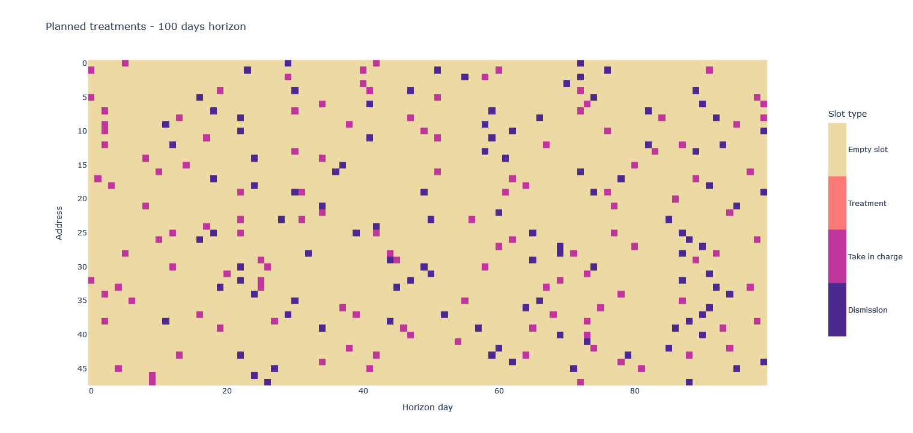

# OAD
OAD project. For now it contains the instance generator.

## Instance generator
The instance generator allows the generation of an event calendar, i.e. a calendar of a given timespan containing information about take-in-charge and dismission events. On the rows we represent the addresses, whereas columns represent days in the chosen timespan. The generator works "by rows".

### Class `OadInstanceGenerator`

Class used for generating an event calendar and an input for the OAD model.

- `seed`: seed for underlying random number generator, in order to ensure replicability. Defaults to `781015`.

Methods:

- *`generate_events_calendar(self, timespan, treatment_span_range, take_in_charge_probability)`*

Args
   - timespan (int, optional): Length of the calendar horizon. Defaults to `30`.
   - treatment_span_range (tuple, optional): Extremes of the interval from which the distance take_in_charge--dismission is sampled. Defaults to `(5, 30)`.
   - take_in_charge_probability (float, optional): Probability of having a take-in-charge event on any given day. Defaults to `1/25`.

Returns: A dict containing information about take-in-charge and dismission events for each address and each day in the horizon.
   
Return type: `dict[str, dict[int, dict[int, int]]]`.
   
- *`generate_input(self, calendar, first_day, last_day, treatments_number_range)`*

Args
   - calendar (dict): Event calendar with take-in-charge and dismission events.
   - first_day (int): First day from which input is generated from the event calendar.
   - last_day (int): Day following the last from which input is generated from the event calendar.
   - treatments_number_range (tuple, optional): Interval `[a, b)` from which the number of daily treatments for each patients is sampled. Defaults to `(2, 5)`.

Returns: A dict containing the parameters for the model.

Return type: `dict`.

### Usage examples

The following example illustrates the usage of `OADInstanceGenerator` in order to generate an event calendar:

```code
    generator = OADInstanceGenerator(seed=58492)
    timespan = 100
    event_calendar = generator.generate_events_calendar(timespan=timespan,
                                                        treatment_span_range=(5, 30))
```

The generated events' calendar corresponds to the following chart.



Suppose we want to generate the an input from the events' calendar, from day 0 (included) until day 10 (excluded), i.e. an input based on 10 days. Then the following code would do what we need:

```code
    solver_input_dict = generator.generate_input(event_calendar, first_day=0, last_day=10)
```
